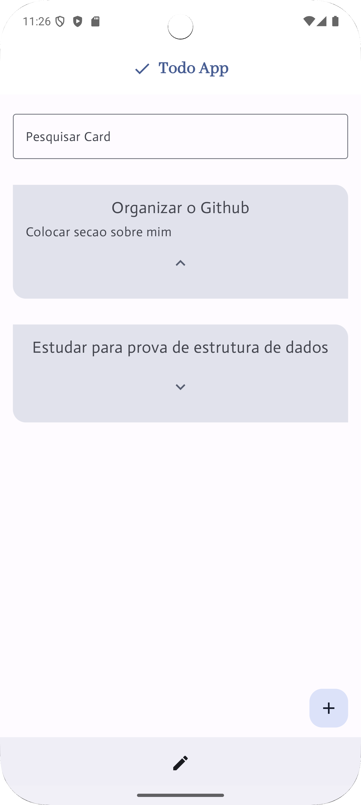

# Todo App

Este é um aplicativo de lista de tarefas simples (Todo App) desenvolvido em **Kotlin** com **Jetpack Compose**, criado para fins de **estudo em desenvolvimento mobile**.

O app permite:

* Adicionar, editar, pesquisar e excluir tarefas.
* Armazenar as informações localmente no **`diretório interno de arquivos do app`** no formato JSON.

---

Para rodar o projeto baixe o android estudio e rode a MainActivity ou baixe e instale direto o Apk através do drive: https://drive.google.com/file/d/1cBLSNdY5IMKZ8ESHqKNf7iw-G0_QdYi7/view?usp=sharing 

    

